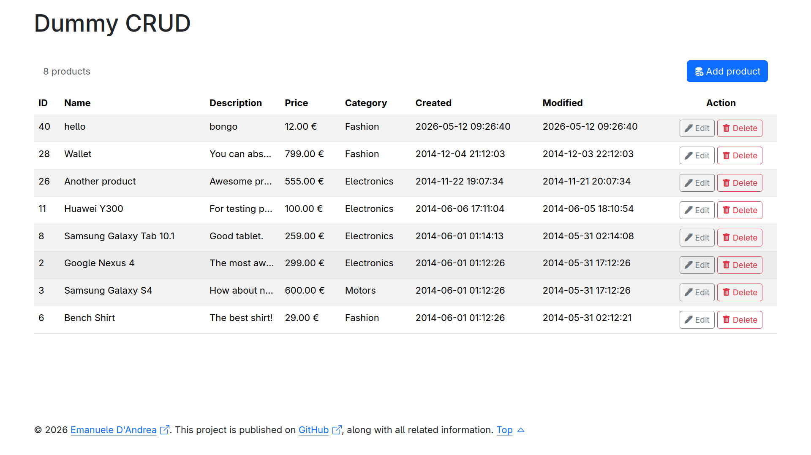

# dummy-crud
A simple CRUD project developed during my studies at a technical institute.

This project **is not intended for production** use. However it can be useful for learning
[Object-Oriented Programming](https://en.wikipedia.org/wiki/Object-oriented_programming): including classes, methods, and basic application structure.
It also has a light demonstration of server-side form validation via PHP.

The interface is made with [Bootstrap](https://getbootstrap.com/) and also gives a simple demonstration of the use of modal dialogs.



## Serve the project

### Using Docker Compose (Linux)

Once cloned on your computer if you have installed docker-compose, you can just run in the same folder of the `compose.yaml`:
```bash
docker compose up -d
```

Once started:

- Project: `http://localhost:8080/`
- Adminer: `http://localhost:8000/`

### Adminer (Database Manager)

Use the same MariaDB credentials defined in `compose.yaml`:

```
server: mariadb
user: user
password: pass
database: crud
```

> [!Important]  
> Remember that if you need to change the database config in the `compose.yaml`, you must also do it in `/config/Database.php`.

### XAMPP (Windows)

Just put the project folder to `C:\xampp\htdocs\` (path for Windows), and visualize it in your browser
at `http://localhost/your-project-name`. 

> [!Note]
> Probably you need to adapt the private member variables in `config/Database.php` with XAMPP MySQL configuration.
